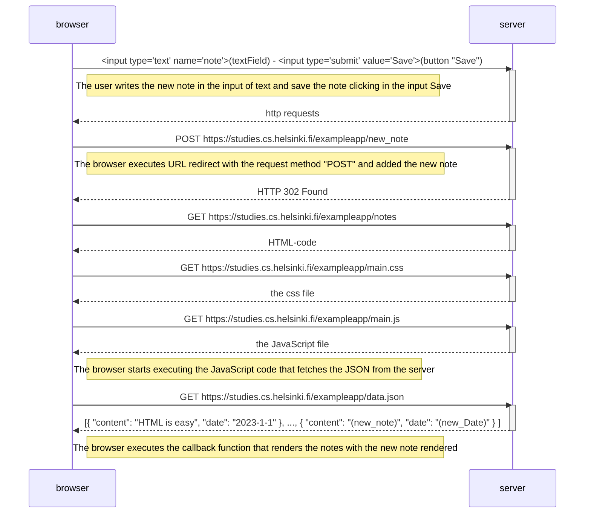

```mermaid
sequenceDiagram
    
    participant browser
    participant server
    
    
    browser->>server: <input type="text" name="note">(textField) - <input type="submit" value="Save">(button "Save")
    activate server
    Note right of browser: The user writes the new note in the input of text and save the note clicking in the input Save
    
    server-->>browser: http requests
    deactivate server
    
    browser->>server: POST https://studies.cs.helsinki.fi/exampleapp/new_note
    activate server
    Note right of browser: The browser executes URL redirect with the request method "POST" and added the new note
    server-->>browser: HTTP 302 Found
    deactivate server

    browser->>server: GET https://studies.cs.helsinki.fi/exampleapp/notes
    activate server
    server-->>browser: HTML-code
    deactivate server

    browser->>server: GET https://studies.cs.helsinki.fi/exampleapp/main.css
    activate server
    server-->>browser: the css file
    deactivate server

    browser->>server: GET https://studies.cs.helsinki.fi/exampleapp/main.js
    activate server
    server-->>browser: the JavaScript file
    deactivate server

    Note right of browser: The browser starts executing the JavaScript code that fetches the JSON from the server

    browser->>server: GET https://studies.cs.helsinki.fi/exampleapp/data.json
    activate server
    server-->>browser: [{ "content": "HTML is easy", "date": "2023-1-1" }, ..., { "content": "(new_note)", "date": "(new_Date)" } ]
    deactivate server

    Note right of browser: The browser executes the callback function that renders the notes with the new note rendered
```