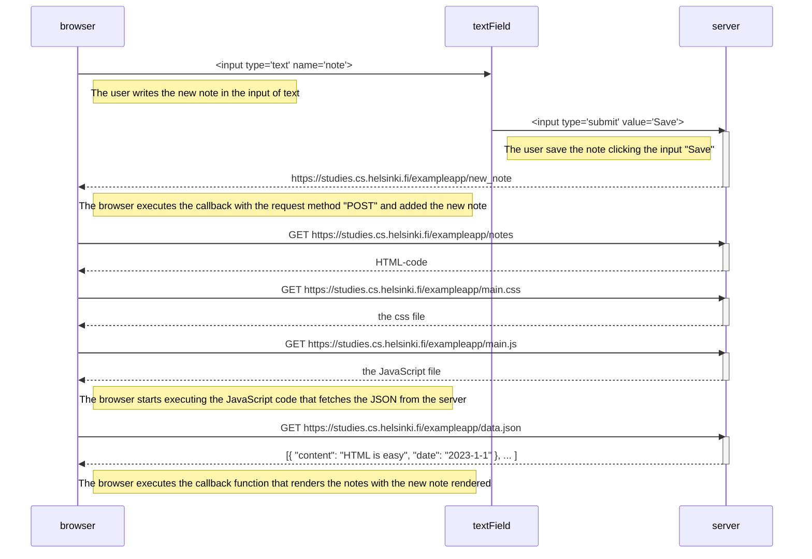

```mermaid
sequenceDiagram
    
    browser->>textField: <input type="text" name="note">
    Note right of browser: The user writes the new note in the input of text

    textField->>server: <input type="submit" value="Save">
    activate server
    Note right of textField: The user save the note clicking the input "Save"
    
    server-->>browser: https://studies.cs.helsinki.fi/exampleapp/new_note
    deactivate server
    Note right of browser: The browser executes the callback with the request method "POST" and added the new note

    browser->>server: GET https://studies.cs.helsinki.fi/exampleapp/notes
    activate server
    server-->>browser: HTML-code
    deactivate server

    browser->>server: GET https://studies.cs.helsinki.fi/exampleapp/main.css
    activate server
    server-->>browser: the css file
    deactivate server

    browser->>server: GET https://studies.cs.helsinki.fi/exampleapp/main.js
    activate server
    server-->>browser: the JavaScript file
    deactivate server

    Note right of browser: The browser starts executing the JavaScript code that fetches the JSON from the server

    browser->>server: GET https://studies.cs.helsinki.fi/exampleapp/data.json
    activate server
    server-->>browser: [{ "content": "HTML is easy", "date": "2023-1-1" }, ... ]
    deactivate server

    Note right of browser: The browser executes the callback function that renders the notes with the new note rendered
```